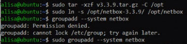
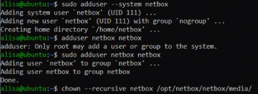
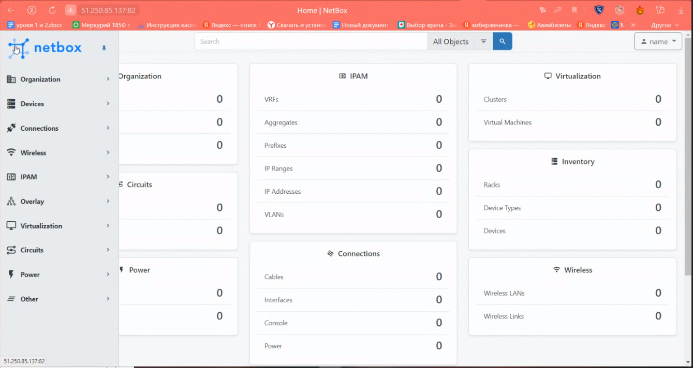
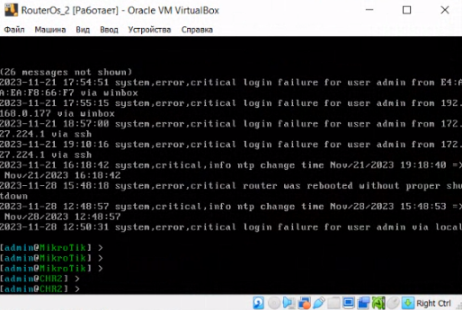

University: [ITMO University](https://itmo.ru/ru/) \
Faculty: [FICT](https://fict.itmo.ru) \
Course: [Network programming](https://github.com/itmo-ict-faculty/network-programming) \
Year: 2023/2024 \
Group: K34212 \
Author: Potitova Valentina Alexandrovna \
Lab: Lab3 \
Date of create: 26.11.2023 \
Date of finished: 07.12.2023

# Лабораторная работа №3 "Развертывание Netbox, сеть связи как источник правды в системе технического учета Netbox"

## Цель работы
С помощью Ansible и Netbox собрать всю возможную информацию об устройствах и сохранить их в отдельном файле.

## Ход работы
Для дальнейшей работы с Netbox установили postgresql. Также была содана база данных netbox, и в ней пользователь netbox


Установили redis. Потом установили netbox из репозитория и создали пользователя

 \


Установили все зависимости, командой ```python3 ../generate_secret_key.py``` сгенерировали ключ.
После этого скопировали файл конфигурации:
```
cd netbox/netbox/
cp configuration.example.py configuration.py
```
В скопированном файле добавили нужные параметры и секретный ключ, сгенерированный ранее


Запустили миграции, создали суперпользователя и загрузили статику


Далее установили nginx и gunicorn, произвели нужные настройки. Отредактировали файл nginx.conf, добавили хост


Переходим по адресу на netbox под суперпользователем, созданным ранее. Открывается интерфейс



Добавили информацию о CHR. Скачали файл [netbox_devices.csv](netbox_devices.csv)


Cоздали файл netbox_change_name_chr.yml, в котором записали название роутера в файл new_playbook1.yml (берется из netbox_devices.csv).

 \


Имена CHR1 и CHR2 изменились в соответствии с информацией из файла new_playbook1.



В netbox сгенерировали токен, после чего создали netbox_settings.yml, где прописали настройки для изменения данных в netbox и указали сгенерированный ранее токен.

 \


В netbox появилось новое устройство


Проверили связь между виртуальной машиной и CHR


Схема связи


## Вывод
С помощью Ansible и Netbox собрали информацию об устройствах и сохранили в отдельном файле. Написали плейбуки для связи Netbox и CHR.