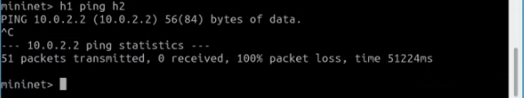
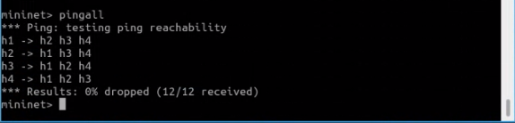
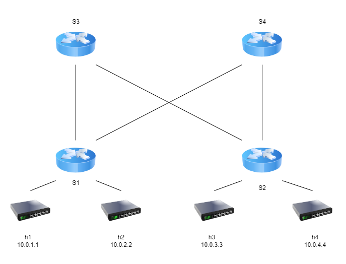
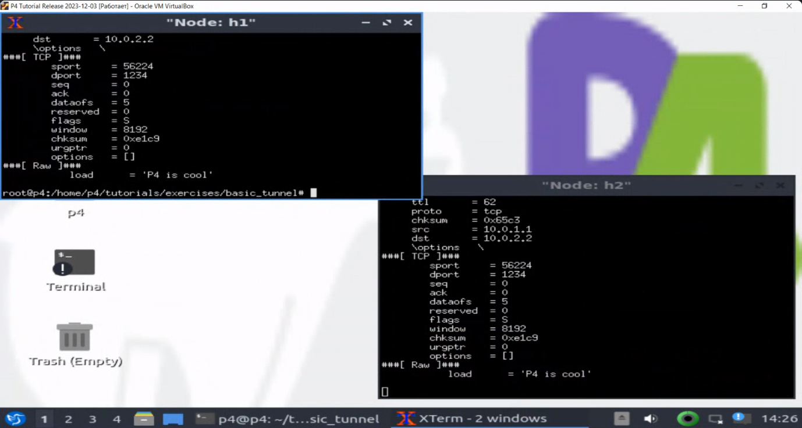
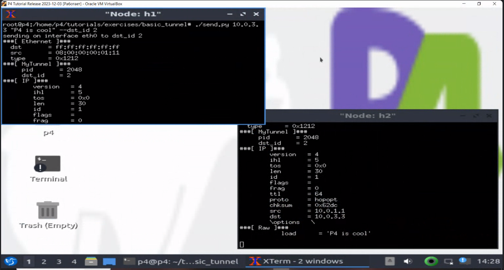
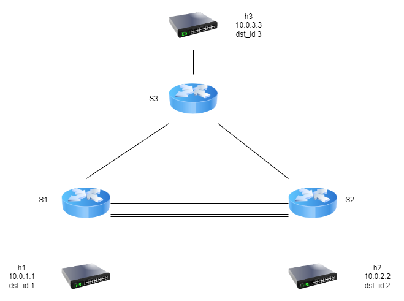

University: [ITMO University](https://itmo.ru/ru/) \
Faculty: [FICT](https://fict.itmo.ru) \
Course: [Network programming](https://github.com/itmo-ict-faculty/network-programming) \
Year: 2023/2024 \
Group: K34212 \
Author: Potitova Valentina Alexandrovna \
Lab: Lab4 \
Date of create: 3.12.2023 \
Date of finished: 7.12.2023

# Лабораторная работа №4 "Базовая 'коммутация' и туннелирование используя язык программирования P4"

## Цель работы
Изучить синтаксис языка программирования P4 и выполнить 2 обучающих задания от Open network foundation для ознакомления на практике с P4.

## Ход работы
Склонировали репозиторий [p4lang/tutorials](https://github.com/p4lang/tutorials). Установили Vagrant. Перешли в папку ```cd vm-ubuntu-20.04```. Используя Vagrant, развернули тестовую среду ```vagrant up```. В результате установки на VirtualBox появилась виртуальная машина с аккаунтами login/password vagrant/vagrant и p4/p4.

Зашли под учетной записью p4 и командой make run запустили mininet.\
Проверили доступность хостов, пинг не прошел, так как по умолчанию все пакеты сбрасываются.



Приступили к изменению файла [basic.p4](basic.p4). \
Добавили в парсер заголовки ipv4 и ethernet.
```p4
parser MyParser(packet_in packet,
                out headers hdr,
                inout metadata meta,
                inout standard_metadata_t standard_metadata) {

    state start {
        /* TODO: add parser logic */
        transition parse_ethernet;
        #transition accept;
    }
    
    state parse_ethernet {
        packet.extract(hdr.ethernet);
        transition select(hdr.ethernet.etherType) {
            TYPE_IPV4 : parse_ipv4;
            default : accept;
        }    
    }

    state parse_ipv4 {
        packet.extract(hdr.ipv4);
        transition accept;
    }
}
```
Для пересылки ipv4 пакетов установили выходной порт, обновили исходный mac-адрес и адрес назначения, поменяли значение TTL. Добавили таблицу маршрутизации и условие проверки заголовка IPv4.
```p4
control MyIngress(inout headers hdr,
                  inout metadata meta,
                  inout standard_metadata_t standard_metadata) {
    action drop() {
        mark_to_drop(standard_metadata);
    }

    action ipv4_forward(macAddr_t dstAddr, egressSpec_t port) {
        /* TODO: fill out code in action body */
        standard_metadata.egress_spec = port;
        hdr.ethernet.srcAddr = hdr.ethernet.dstAddr;
        hdr.ethernet.dstAddr = dstAddr;
        hdr.ipv4.ttl = hdr.ipv4.ttl - 1;
    }

    table ipv4_lpm {
        key = {
            hdr.ipv4.dstAddr: lpm;
        }
        actions = {
            ipv4_forward;
            drop;
            NoAction;
        }
        size = 1024;
        default_action = NoAction();
    }

    apply {
        /* TODO: fix ingress control logic
         *  - ipv4_lpm should be applied only when IPv4 header is valid
         */
        if (hdr.ipv4.isValid()) {
            ipv4_lpm.apply();
        }
    }
}
```
Добавили заголовок.
```p4
control MyDeparser(packet_out packet, in headers hdr) {
    apply {
        /* TODO: add deparser logic */
        packet.emit(hdr.ethernet);
        packet.emit(hdr.ipv4);
    }
}
```
Проверили подключение командой pingall - пакеты доходят.



Схема связи



Изменили файл [basic_tunnel.p4](basic_tunnel.p4).

Добавили новый заголовок myTunnel_t.
```p4
#// NOTE: added new header type
header myTunnel_t {
    bit<16> proto_id;
    bit<16> dst_id;
}
```
```p4
#// NOTE: Added new header type to headers struct
struct headers {
    ethernet_t   ethernet;
    myTunnel_t   myTunnel;
    ipv4_t       ipv4;
}
```
Был изменен парсер parse_ethernet. В зависимости от значения etherType будет извлечен заголовок ipv4 или myTunnel.
```p4
state parse_ethernet {
    packet.extract(hdr.ethernet);
    transition select(hdr.ethernet.etherType) {
        TYPE_IPV4 : parse_ipv4;
        TYPE_MYTUNNEL : parse_myTunnel;
        default : accept;
    }
}
```
В парсер была добавлена функция извлечения заголовка myTunnel.
```p4
state parse_myTunnel {
    packet.extract(hdr.myTunnel);
    transition select(hdr.myTunnel.proto_id) {
        TYPE_IPV4 : parse_ipv4;
        default : accept;    
    }
}
```
Написали функцию для определения выходного порта.
```p4
#// TODO: declare a new action: myTunnel_forward(egressSpec_t port)
action myTunnel_forward(egressSpec_t port) {
    standard_metadata.egress_spec = port;
}
```
Определили таблицу для маршрутизации пакетов.
```p4
#// TODO: declare a new table: myTunnel_exact
#// TODO: also remember to add table entries!
table myTunnel_exact {
    key = {
        hdr.myTunnel.dst_id: exact;
    }
    actions = {
        myTunnel_forward;
        drop;
        NoAction;
    }
    size = 1024;
    default_action = NoAction();
}
```
Функция apply использует таблицу, соответствующую типу пакета.
```p4
apply {
    #// TODO: Update control flow
    if (hdr.ipv4.isValid() && !hdr.myTunnel.isValid()) {
        ipv4_lpm.apply();
    }
    if (hdr.myTunnel.isValid()) {
        myTunnel_exact.apply();
    }
}
```
Обновили депарсер.
```p4
control MyDeparser(packet_out packet, in headers hdr) {
    apply {
        packet.emit(hdr.ethernet);
        #// TODO: emit myTunnel header as well
        packet.emit(hdr.myTunnel);
        packet.emit(hdr.ipv4);
    }
}
```
Отправили пакет с h1 на h2 без туннелирования. Пакет с переданным сообщением дошел до адресата.



Теперь отправили пакет на адрес h3, указав данные для заголовка туннелирования dst_id для h2. Пакет не дошёл до h3, а отправился на h2, так как применилась таблица маршрутизации myTunnel_exact. В заголовках виден дополнительный - MyTunnel.



Схема связи



## Вывод
В ходе работы был изучен синтаксис языка программирования P4 и выполнено 2 обучающих задания от Open network foundation для ознакомления на практике с P4.